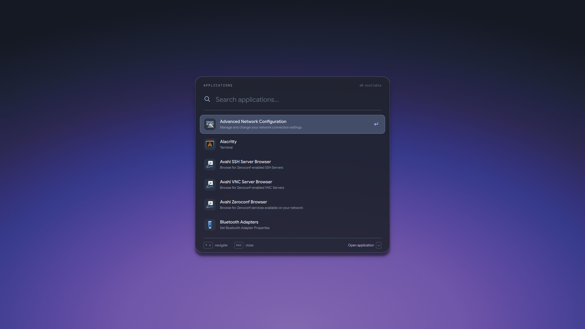

# Desktop Foundation

A Niri-first Arch-family desktop with graphite/glass surfaces, wallpaper-derived
accents and no permanent bar. CachyOS is the reference distribution. Arch and
EndeavourOS can use the foundation when their packages pass the native capability
checks; the installer never adds a repository or converts an initramfs stack.

The desktop includes launcher, persistent text/image clipboard, Bluetooth and
Nothing/CMF controls, power menu, quiet notifications, volume feedback,
clipboard-only Niri screenshots, sharp wallpaper/blurred overview and a shared
Kitty/Fish/Fastfetch environment. No account data is included.

**v0.12-1 is a maintenance prerelease** with a shared Rust backend and reliability
improvements. Static/isolated integration checks pass; live candidate visual,
audio/Bluetooth and full-session acceptance remain pending. See the
[release notes](docs/releases/0.12-1.md).

Development after v0.12-1 also moves Bluetooth radio control and playback-codec
discovery into the shared Rust backend. See [backend behavior and measurements](docs/backend.md).



[View the screenshot gallery](docs/screenshots/README.md) — launcher, clipboard,
Bluetooth, power menu, terminal, overview and volume readout.

## Install the desktop, then optionally your applications

Use a normal sudo-enabled user with working graphics, networking, Git and Python.
Keep the checkout in a permanent location: deployed links refer to it.

```sh
git clone --branch v0.12-1 https://github.com/ppqalt/desktop-foundation.git
cd desktop-foundation
./scripts/install-core --dry-run
./scripts/install-core
# Optional: foundation plus personal applications
./scripts/install-all --dry-run
./scripts/install-all
```

`install` remains the full-install alias; `install --core` and `install --personal`
remain compatible. Both layers support `--check`, `--dry-run`, `--no-packages`,
`--no-greeter` and `--hardware-profile NAME`. Full reuses the core implementation.

**Core** includes Niri/Quickshell, all shell surfaces, input/window behavior,
wallpaper/Matugen, terminal/fonts, audio/Bluetooth, portals, authentication and
reversible deployment. Brave Origin Nightly, Nautilus, Papers, Loupe and GNOME Text Editor
provide working application roles without personal apps.

**Full** additionally provisions/adopts Brave Origin Nightly, the verified
CachyOS ChatGPT package, stock native Steam, and checksum-pinned user-local
Spotify/Spicetify/Marketplace with graphite colors. ChatGPT must be available in
your configured signed repositories; Steam requires multilib. Neither is silently
substituted. **Millennium/Material is excluded from v0.12** pending loader/theme
activation acceptance. See [personal applications](docs/personal-apps.md).

The installer uses full Pacman upgrades for missing packages and presents AUR
recipes through Paru for review. Log into **Niri** after installation. The tested
Niri 26.04 build supports native blur/background effects; preflight validates the
actual parser. A version number alone is insufficient. Matrix-capable tuigreet
is likewise checked. If you already use another login manager, select
`--no-greeter`; it will not be displaced automatically.

Existing machines are supported through backups and ownership journals. Owned
paths changed externally cause a conflict, rather than being overwritten.
Unrelated associations survive MIME updates and rollback. Existing terminal
configurations are backed up as directories; they are not merged automatically.
Read [installation and migration](docs/installation.md) before replacing an
existing setup. The portable profile assumes no hostname, GPU or output size.

## Interaction and appearance

- Finnish input; `/` uses Shift+7. Hardware/input configuration stays separate.
- Scrolling columns; one tiled column centers natively, multiple columns retain
  normal scrolling. Super+C centers manually.
- Equal active/inactive 96% content opacity, 14 px corners, borders and soft
  shadows for focus. Kitty uses native 90% background opacity and opaque glyphs.
- Super+Space launcher; Super+V clipboard; Super+B Bluetooth;
  Super+Shift+Q power/session. Wheel/arrows select; click/Enter activate.
- Super+T/Enter terminal, Super+E files, Super+W browser, through explicit roles.
- PageUp/PageDown change volume by 3%; End toggles playback.
- Super+Shift+C toggles a small, click-through clock in the top left.
- Print copies the current output; Super+Shift+S copies a dragged region.
  Niri captures are clipboard-only. The secondary Hyprland backend also saves files.
- Google Sans and Google Sans Code Nerd Font Mono; compact Fish prompt, `c` and
  `fast`, cached foreign-package counts and retained 10,000-line Kitty scrollback.
- One wallpaper process; transient top-center notifications. No wallpaper/theme
  polling or resident Matugen process.

Settings/cheatsheet bindings are reservations, not implemented control panels.
See [bindings](docs/input-bindings.md), [Bluetooth](docs/bluetooth.md) and
[native earbud controls](docs/nothing-controls.md).

## Wallpaper and theme

```sh
./scripts/wallpaper-set /path/to/image           # fill, preserving aspect ratio
./scripts/wallpaper-set /path/to/image --mode fit
./scripts/theme-rollback
```

Wallpaper, semantic graphite colors, blurred overview and adapter outputs form
an immutable runtime revision. Publication switches one pointer; staging failure
leaves the current revision untouched. Ordinary changes do not dirty Git.
Matugen supplies accents; surfaces remain mostly neutral graphite. Cached/no-op
changes avoid regeneration. [Theme documentation](theme/README.md) describes
transactions, fallback, promotion and reload behavior.

Quickshell/overview update live; Niri, Kitty and Mako reload. Native GTK accent
uses the supported discrete setting where available, without CSS overrides.
Fish/Fastfetch and Spotify take new colors on next launch (Spotify can use native
Reload sooner). Brave generates a stable unpacked theme folder but needs native
import/reload. Browser debugging is **off by default**, never enabled by installation.

Spotify first login is yours: leave it open a minute, quit normally and reopen.
The managed launcher finishes patching after the first unpatched launch.
No credentials, sessions or application account preferences are copied.

## Inspect and recover

```sh
./scripts/install-core --check
./scripts/install-all --check
./scripts/doctor --personal
./scripts/session-acceptance
./scripts/uninstall                    # configuration/preferences, not packages
./scripts/uninstall --greeter          # also restore greetd/PAM files
./scripts/spotify-setup restore        # optional app links/config/tool upgrade
```

Doctor is read-only. Browser profiles, Steam libraries/userdata, accounts,
network/Bluetooth pairings, SSH/Git and personal files remain local. Keep the
checkout and backups until restoration completes. [Application roles](docs/application-roles.md)
explain per-key restoration and conflict handling.

AppArmor remains part of the foundation. Already enabled kernels need no boot
rewrite. Automated activation requires compatible GRUB drop-in support;
[other boot setups need their documented native configuration](docs/APPARMOR.md).
`--clean-boot` is an explicit, separately journaled GRUB/mkinitcpio transaction;
never use it to convert dracut. Existing boot transactions need review before
reinstallation. See [boot recovery](docs/boot-optimization.md).

## Validation and limits

v0.12 has automated preservation/rerun tests and focused live acceptance on the
reference machine. A physical fresh OS install and lucky38 acceptance have not
been performed for this release. See [release validation](docs/releases/0.12-validation.md)
and the [fresh-install checklist](docs/fresh-install-v012.md); checks do not certify
an untested GPU/package combination.

Development: `scripts/bootstrap --dev`, `scripts/check`, `scripts/test`.
Hyprland remains a secondary backend: `scripts/bootstrap --hyprland`, then explicit
`deploy --compositor hyprland`; it is not the reference appearance target.
See [contributing](CONTRIBUTING.md), [deployment](docs/deployment.md),
[fonts and licenses](fonts/README.md), and [publication boundaries](docs/publication.md).
The optional native device backend includes its AGPL license and attribution.
