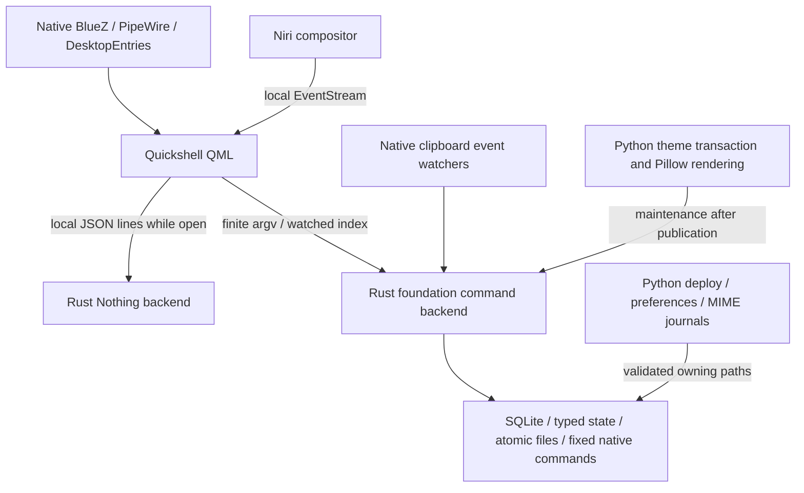

# Code quality and performance review — lucky38, 2026-10-03–04

Starting revision: `bbddde0`, eight commits beyond v0.12. Implementation work is
isolated on `lucky38/rust-quality`; the installed checkout, SDDM, wallpaper,
configuration, services, packages and session remain the baseline. No push or
release tag is part of this pass.

## Review before implementation

The repository has approximately 6,129 lines of Python, 1,499 helper-script lines,
1,385 Rust lines, 3,739 QML lines and 236 Lua lines, plus tests, configuration and
documentation. The inventory includes all tracked source directories, tests,
installer entry points, CI, licenses/provenance and historical validation notes.
Historical Tops acceptance is not evidence of current lucky38 acceptance.

| Subsystem / language | Runtime and resource implications | Ownership, weaknesses and Rust decision |
|---|---|---|
| Niri KDL / Python generator / Lua intent | Generated at deployment/theme change; two Lua subprocesses per render. Native compositor owns effects, layout and Finnish input. | Shared intent and host overrides are separated correctly. Preserve lucky38 profile. Lua execution is occasional and necessary for secondary-backend compatibility; no rewrite justified here. |
| Quickshell QML composition | One shell; lazy launcher/clipboard/Bluetooth/power, resident overview and small hidden volume object. No persistent helper daemon. | Preserve every visual token, animation and layout. No evidence supports deleting effects or moving rendering to Rust. |
| Niri QML adapter | Direct local socket event stream, normalized copies of windows/workspaces, coalesced output reads, bounded action queue. No subprocess per event. | Requests lack a response deadline: a stalled request can wedge the queue. Add failure recovery. Moving this working direct socket into a daemon would duplicate state/IPC without a measured benefit. |
| Hyprland QML/Lua adapter | Native Quickshell subscriptions and relevant coalesced refreshes. Secondary backend. | Native identifiers remain adapter-local. Preserve supported behavior; runtime acceptance needs a separate Hyprland session. |
| Launcher QML/JS | Native desktop-entry model, lazy view, virtualized rows and 32 px icon decode. Search re-ranks when query/model changes. One launch command. | Search text is never evaluated as shell. Native discovery already handles metadata/localization; do not replace it with a less complete Rust scanner. Role launches are a separate worthwhile one-shot Rust candidate. |
| Clipboard Python/SQLite/QML | Two native wl-paste event watchers and wl-clip-persist; Python starts on each selection/action. 100 entries, 8 MiB/item, 32 MiB payloads, 2,048-character previews. | DB lock/transaction and private modes are good. Fixed temporary filename, projection cleanup and error handling need hardening. Migrate storage/actions into typed Rust while keeping schema, hash IDs, exact payloads and JSON contract. |
| Theme Python / Matugen / Pillow | One-shot palette generation, several whole-file hashes and native renderer subprocesses. Cached blur outside UI; complete immutable bundles. | Atomic current/previous pointers and reload rollback matter more than rewrite speed. Revisions/palette/overview caches are unbounded; introduce guarded Rust maintenance. Keep orchestration until crash-recovery migration has its own parity tests. |
| Wallpaper Python → swaybg | Startup helper execs one upstream wallpaper process; no retained interpreter. | Hash/cache generation is occasional. Preserve scaling and blur. Cache publication should be atomic, not a direct final-file write. |
| Notifications Python/shell → Mako | One D-Bus-owned Mako unit, packaged activation alias, owner check. Upstream expiry timers. | Existing provider is respected. No custom notification history exists to migrate; inventing one would change scope/ownership. |
| Bluetooth QML / Python | Native BlueZ and PipeWire state in UI. On-demand busctl/pactl actions, event subscription during audio setup; bounded connection retries. | Avoid moving native models into a duplicate resident backend. Generic codec setup remains Python until hardware parity covers device reconnect/routing/child cleanup. |
| Nothing/CMF Rust | On-demand single-thread Tokio RFCOMM backend; JSON lines, notifications and finite deadlines, exits with surface. | Already Rust. Readback validation is good. Framing resynchronization removes bytes one at a time; input line bound is checked after allocation; runtime gesture unwraps and broad Tokio features deserve repair. Keep AGPL attribution. |
| Volume Python | Starts per keypress, lock, wpctl set/read, Quickshell IPC, notification fallback. No daemon. | Good behavior, but unbounded native set/read calls. Suitable for the shared Rust command backend with bounded subprocesses and identical 3% steps/OSD fallback. |
| Power Python / QML | Fixed commands only, --check routing, no resident helper. | Preserve explicit interaction and session-exit routing; a small typed Rust action registry can serve this existing consumer and future menus. Never execute power operations in tests. |
| Session Bash / Python units | Startup imports environment, starts one target; independent shell/notifications/polkit, clipboard init before native watchers. | Correct lifecycle and restart limits. Do not create a service for the new one-shot backend. Generated units change only on deliberate future deployment. |
| Application roles Python | Launch validates desktop entries on each use; apply/check/restore manage exact MIME keys and separate journal. xdg queries are occasional. | Move frequent launch parsing/validation to Rust; retain complex MIME ownership/recovery until fully ported. Preserve Brave choice and unrelated defaults. Avoid two xdg-mime queries for a failed key. |
| Deploy / preferences Python | Occasional locks, write-ahead symlink/key journals, native config validation, original backups and external-change refusal. | Significant recovery coverage. Preferences restoration cannot resume after partial native writes; repair that bug with tests. No benefit from wholesale rewriting during this pass. |
| Installer / boot / greeter Python/Bash | Explicit maintenance only; package/system writes separated from user session. | SDDM is preserved with --no-greeter. Retain boot/system original journals and reject foreign paths; do not exercise installation or boot changes on lucky38. Privileged journal durability remains separate debt. |
| Spotify Python / Brave Python/JS | User-requested install/seed and one-shot theme refresh; no account data copied. Pinned archives, narrow native-browser adapter. | Preserve original tool/config backups. Streaming hashing and archive-size bounds are future maintenance improvements; not an idle optimization. |
| Fish/Kitty/Fastfetch Python → Rust | Native terminal; foreign package count cached against package DB signatures; two pacman-conf queries per invocation. | Cache avoids repeated pacman enumeration. Move the cached package query to Rust; preserve signatures and native Fastfetch formatting. The native terminal appearance stays unchanged. |
| Doctor Python | Read-only, many bounded one-shot system/package/XDG queries. | Healthy baseline with --core --no-greeter. Report failure accurately; no resident health worker. Batch queries/migrate typed checks later when host coverage exists. |
| Tests / CI / documentation | 107 portable Python tests, 9 Rust tests; Qt adapter opt-in, live harnesses separate. CI omits QML/Niri native capability gates. | Strengthen Rust fmt/Clippy/test gates, include lucky38 in config checks and publish migration/measurement contracts. Keep destructive/live tests opt-in. |

## Complete timer and polling inventory

There is no steady-state foundation polling process. Retained timers have distinct
purposes; a timer used for expiry or a user-requested deadline is not periodic
state polling.

| Location | Frequency / bound | Purpose and decision |
|---|---|---|
| Niri adapter centering | 80 ms one-shot restart on window/workspace events | Debounce, preserve existing single-window behavior. |
| Niri adapter response deadline | 3 s one-shot per active request | Added stalled-output reconnect and stalled-action queue recovery; never replay an action with an unknown outcome. |
| Niri adapter reconnect | 1–30 s exponential one-shot, only while disconnected | Reconnect after actual failure; preserve. |
| ClipboardHistory | 150 ms, at most 20 attempts / 3 s while index missing | Startup race only; subsequent file notifications. Preserve bounded fallback. |
| OverviewBackdrop | 250 ms, at most 20 attempts / 5 s while manifest missing | Startup race only; normal file watcher. Preserve. |
| Volume | 1.5 s one-shot on presentation | Required OSD expiry, preserve. |
| BluetoothPopup | 120 s one-shot after battery receipt; 120 ms exit | Cached battery expiry and animation cleanup; no battery poll. |
| NothingControls | 1.5 s shutdown, 6 s command (24 s fit), 35 s startup | One-shot failure/cleanup deadlines, preserve. |
| Rust earbud backend | 2 s query, 3 s write/ring, 10 s connect, 20 s fit; 120 s battery expiry | Event-driven socket/D-Bus/select; one-shot deadlines. No battery refresh poll. |
| Rust earbud connect | 100/200/400/800/1,600 ms, finite retry | User-requested connection only, preserve. |
| bluetooth-power.py | 150 ms, bounded 5 s retry window (each bus call bounded 2 s) | BlueZ readiness after rfkill; worthwhile future D-Bus Rust migration, not resident polling. |
| bluetooth-action.py | Initial 5 s wait after codec reboot, 2 s retry within 30 s (calls separately bounded) | Device reboot/reconnect behavior; preserve. Audio setup waits for relevant pactl events within 12 s. |
| Rust shell IPC readiness | 50 ms pauses within a monotonic 3 s budget; each probe ≤500 ms; final action ≤3 s | Replaces the shell loop whose native calls were unbounded. Discard readiness status output, invoke requested action once. No idle activity. |
| Rust subprocess execution | Event-driven pipe poll ≤50 ms; process-exit retry ≤5 ms when no pipes remain; caller-specific deadlines | Finite command execution only. No reader/writer threads or blocking joins; detached pipe holders cannot extend the deadline. |
| Rust storage/volume/theme locks | 10 ms retries within a 5 s contention deadline | Only while a requested operation waits for its owner; no resident worker. |
| Spotify launcher | Waits for native process exit without a poll loop | First-run patch completion after a normal quit; no timer. |
| Brave DevTools adapter | 45 s one-shot deadline | Explicit opt-in native theme lifecycle operation, no event subscriptions or network listener. |
| bench/startup/trace/profile/smoke/failure/boot-report and live tests | 10–100 ms readiness probes; finite test deadlines, explicit 1–45 s sample waits | Development diagnostics only. Leave separate from session startup. Some operate the live desktop and must remain opt-in. |
| theme contrast loop, protocol parsing, filesystem inventory loops | No scheduling interval | Finite computation/data traversal; not polling. |
| Mako/Qt/PipeWire/BlueZ/Niri/SDDM upstream | External native event/render/expiry behavior | Do not replace upstream internals or disable effects to improve a counter. |

## Recorded baseline

Three consecutive 10-second live samples, same PIDs. Live user activity is not
controlled; these describe current costs, not a before/after optimization claim.
Context switches are not measured hardware wakeups.

| Process | PSS KiB | RSS KiB |
|---|---:|---:|
| Quickshell | 238,481 | 330,644 |
| Niri | 148,089 | 210,568 |
| Mako | 6,348 | 21,920 |
| swaybg | 3,564–3,567 | 16,440 |
| hyprpolkitagent | 36,152 | 92,656 |
| wl-clip-persist | 3,381 | 5,864 |
| wl-paste text | 203 | 2,292 |
| wl-paste image | 199 | 2,344 |

Seven supporting desktop processes, plus Niri. Quickshell records zero CPU ticks
and 0–0.1 surviving-thread context switches/s; other supporting workers record
zero CPU ticks. Niri records 1.5–1.6% of one core and about 93–94 switches/s under
this live workload. No claim of zero wakeups follows from those counters.

The initial unpaired clipboard probe was used only to establish a plausible
transient cost. The final controlled, interleaved comparison below supersedes it.
All fixtures contain synthetic data; no real clipboard content was read.

Storage: tracked file payloads 35,327,273 bytes; original checkout allocated
836,689,920 bytes including 778,653,696 bytes of Rust target output. Runtime state
185,274,368 bytes, theme 37,240,832 bytes (four revisions), cache 806,912 bytes.
Originals/backups remain untouched. The installed Nothing release binary is
4,655,416 bytes. Build output is not the deployed binary budget.

Baseline doctor and `install-core --check --no-greeter` pass. ShellCheck/shfmt were
missing; verified upstream binaries were downloaded into temporary tooling only,
without a package installation. Initial QML lint exits 0 with metadata/property
warnings; formatting and available validators pass. Final results and controlled measurements follow.

## Architecture after the pass

The same compositor, shell and native providers remain. `native/foundation`
adds one reusable command executable, **desktop-foundationctl**, for non-UI
operations. It exits after each operation; app/power handoffs replace the process.
There is no new service, privileged API or network listener. Clipboard watchers
remain event driven. Quickshell still owns rendering, animation and native
BlueZ/PipeWire/DesktopEntries presentation models. Nothing/CMF remains a separate
Rust backend whose lifetime belongs to its control surface.

### Main problems found and corrected

- Frequently invoked Python helpers carried interpreter/import overhead for
  clipboard, role launches, volume, power and package information.
- Native subprocess failures and unbounded calls could stall actions. The shared
  Rust runner uses argv arrays and bounds captured output, pipe activity and
  process lifetime; clipboard/device entry points bound their inputs.
  Nonblocking pipe I/O handles detached descendants without a blocking join.
  Failed commands clean up their own process group; successful clipboard owners
  survive. Escaped descendants are not found and killed indiscriminately.
- Niri output/action requests could wedge a queue forever. A three-second response
  deadline reconnects/resnapshots after output failure and continues the action
  queue without replaying a possibly completed operation.
- Fixed-name/non-durable cache publication, leftover interrupted clipboard files,
  missing clipboard sidecars, corrupt blur caches and unlimited cache retention
  needed recovery rules.
- Nothing framing repeatedly shifted the entire input buffer, command lines could
  allocate without a bound, and malformed gestures could reach panic conditions.
- Preferences restoration could become non-resumable after some native writes.
  Restoration now journals each pending original and removes each completed key;
  a later retry preserves externally changed settings.
- Screenshot selection/geometry/native failures could be mistaken for cancellation.
  Negative coordinates, cancellation, capture errors and PNG output are handled
  explicitly; interactive selection keeps its original indefinite user wait.
- Doctor lost native stderr and misclassified Quickshell's empty-instance outputs.
  Both empty JSON and the installed CLI's successful non-JSON empty result are
  recognized, while malformed data remains an error.
- Direct deployment could publish callers before required binaries existed.
  Both release executables are now required before installation writes anything.
  Restore and dry-run do not depend on builds.
- Migrating the Fastfetch helper exposed the immutable-bundle copy topology.
  Rendered helpers now pin their owning checkout and retain their own revision's
  package configuration; tests include current/config symlinks and quoted paths.

### Rust already present, migrated, and deliberately retained elsewhere

The existing Nothing crate provides Bluetooth/RFCOMM framing, device commands,
readback/verification, battery/gesture/control state and JSON-line IPC. It retains
its AGPL provenance and attribution. This pass improves it rather than replaces it.

The new shared Rust crate contains typed clipboard records, application-role
selection and desktop-entry validation, a nine-action registry, power routing,
volume handling, package cache/signatures, shell IPC readiness, filesystem locks,
atomic publication, guarded theme/cache retention and bounded subprocess execution.
It accepts existing clipboard SQLite/cache formats. Old clipboard/volume Python
entry points are compatibility exec shims, not duplicate implementations. Caller
paths use Rust directly. Power's old Python implementation was removed.

The following remain deliberately outside Rust:

| Retained implementation | Reason and future direction |
|---|---|
| QML/JS rendering, search presentation, animations, layouts and event adapter | Native UI/event integrations are already efficient. Moving them into a daemon would duplicate state and add IPC/resident memory. |
| Pillow/Matugen and Python theme revision transaction | Pixel appearance, reload ordering, rollback pointers and crash recovery need independent parity coverage before a larger port. Hashing now streams through optimized hashlib instead of loading the whole file; adding one Rust process per hash would be wasteful. Rust already owns reusable retention. |
| Python deploy/installer/boot/SDDM-compatible greeter/preference/MIME journals | Rare maintenance paths, substantial recovery/ownership rules and privileged integration. Bugs were repaired in place. Port a shared journal deliberately once power-loss/host coverage exists. No mutating installer run was executed here. |
| Python generic Bluetooth/audio codec setup | Native UI state is already subscribed. Hardware reconnect, reboot and routing behavior need physical parity before porting the busctl/pactl orchestration. |
| Python doctor/system inspection | Read-only and requested occasionally, with bounded native calls. It is a suitable next typed Rust maintenance module; a resident monitor would add idle cost. |
| Lua compositor intent and small shell handoffs | Shared secondary-backend configuration and a few fixed commands are straightforward; rewriting them would add complexity without a runtime benefit. |
| Spotify/Brave optional integration | Occasional, explicit application maintenance. Preserve existing backup/account boundaries; streaming archive bounds and transaction reuse remain debt. |

### Process creation and polling changes

| Path | Before | After |
|---|---|---|
| Clipboard event/action | Python process per operation | One Rust process; direct watcher/QML argv avoid compatibility shims. Native watchers and wl-copy ownership unchanged. |
| Role launch, volume, power | Python implementation plus required native handoffs | One shared Rust implementation; hot wrapper execs go directly to the binary. Required native commands still run. |
| Surface shortcut during startup | Shell readiness loop, external dirname and one sleep process per failed probe; native query unbounded | Rust readiness budget, native query deadlines and in-process waits. Requested action runs once. Outer wrappers also avoid dirname and a second wrapper startup. |
| Volume | wpctl set/read and IPC; notification fallback | Same native command count and behavior, bounded failures; no duplicate PipeWire worker. |
| Fastfetch | Python plus two pacman-conf calls, Fastfetch and occasional pacman | Rust plus the same native calls/cache; no package monitor. Copied revision routing preserved. |
| Failed MIME check | Repeated xdg-mime query for the same key | Reuse the failed query's result. |
| Niri/window events | Direct socket subscriptions | Retained; no per-event subprocess and no new polling daemon. |
| Theme hashing/blur | Whole-file hash reads and direct cache write | Bounded hash reads, atomic blur; same renderer and visual pixels. |

The timer inventory above covers every production timer/retry loop and separately
classifies development harnesses. **No steady-state polling loop was removed**:
the baseline already uses event streams, native signals and file watches. Startup
readiness now has an actual wall deadline. Expiry, animation, debounce and genuine
failure retries remain. New request/command/lock deadlines have no idle cost.

## Controlled helper performance

Host: lucky38, CachyOS kernel 7.2.8-2-cachyos, Niri 26.04 (8ed0da4), Quickshell
0.3.1, Rust 1.98.1, Python 3.14.7. The installed monitor baseline is DP-1,
2560×1440 at 155 Hz, scale 1. The benchmark does not render a surface.

The clipboard comparison uses baseline bbddde0 and the final release backend,
alternates old/new order after two warmups, and gives each run a fresh private
history on the checkout's filesystem. No builds or full test suites run during
samples. The small Rust wait4 parent avoids inherited Python peak-memory bias.
Hardware: AMD Ryzen 7 5700X3D 8-Core Processor, 16 logical processors, btrfs
checkout filesystem. Power/frequency/governor state was not recorded and foreground
activity was not controlled; order, fixtures and storage are paired rather than
claiming a fixed-clock laboratory setup.

Warm filesystem/process startup and fsync costs are included. CPU is the child's
user+system time. These are medians, not claims about p95 or cold startup.

| Clipboard store | Samples per implementation | Wall ms before → after | CPU ms before → after | Peak helper RSS KiB before → after |
|---|---:|---:|---:|---:|
| Text, 9,728 bytes | 24 | 52.279 → 9.850 | 45.578 → 2.908 | 22,910 → 4,796 |
| Image fixture, 1 MiB | 10 | 74.531 → 17.025 | 66.242 → 8.146 | 30,524 → 8,866 |

Index projections match apart from timestamps/state paths, and separate parity
tests cover the same database, Unicode/NUL payloads, hashes and image sidecars.
The image fixture tests storage/signature behavior; it is not an image decoder test.

Nothing parser stress: 65,536 garbage bytes followed by an exact valid packet,
identical optimized compiler, two warmups per interleaved block and 36 measured
samples per implementation: **22.922 ms → 0.0326 ms** median. Output is identical.
This measures corruption resynchronization, not normal device latency or idle CPU.

GUI first-frame/popup latency was not measured: routine tests use isolated,
non-rendering Qt fixtures. No visual, Bluetooth hardware, real power, physical
login or Hyprland-session acceptance is claimed for the candidate.

## Live RAM, CPU, process count and measurement limits

The candidate is **not activated**. Both read-only observations sample the original
same-PID session three times for ten seconds. Activity, cache residency and shared
pages differ; the following cannot establish a before/after performance gain.
The increased wallpaper/compositor memory is reported instead of attributed to
code that is not running.

| Process | Initial PSS / RSS KiB | Later readback PSS / RSS KiB |
|---|---:|---:|
| Quickshell | 238,481 / 330,644 | 234,796 / 327,876 |
| Niri | 148,089 / 210,568 | 174,053 / 237,128 |
| Mako | 6,348 / 21,920 | 6,209 / 21,816 |
| swaybg | 3,564–3,567 / 16,440 | 36,089 / 49,004 |
| polkit agent | 36,152 / 92,656 | 35,335 / 92,552 |
| wl-clip-persist | 3,381 / 5,864 | 6,040 / 8,524 |
| wl-paste text | 203 / 2,292 | 203 / 2,292 |
| wl-paste image | 199 / 2,344 | 199 / 2,344 |

Supporting-desktop PSS, including polkit and excluding Niri: **288,328–288,331 →
318,871 KiB**, observational only. All supporting processes record zero CPU ticks
in both sets. Quickshell records 0–0.1 surviving-thread context switches/s in both.
Niri records 1.5–1.6% → 2.2–2.5% of one core and 93–94 → 118–129 switches/s under
different live workload. Hardware wakeups were not measured; zero CPU ticks are
limited by kernel tick resolution. Do not claim idle CPU/RAM savings from these.

Runtime count remains **seven supporting processes plus Niri, eight total**.
No new persistent backend exists. Nothing is on demand and was not open during
measurement. The controlled memory gain is the transient clipboard worker above.

## Storage and dependency budget

| Item | Before | After / decision |
|---|---:|---|
| Tracked payload before final report data | 35,327,273 bytes | 35,490,751 bytes at 6bac61f; source/tests increase, not runtime cache. |
| Original checkout allocated / Rust target | 836,689,920 / 778,653,696 bytes | Original build tree retained. |
| Isolated quality checkout allocated | Separate checkout did not exist | 1,479,987,200 → 1,227,235,328 bytes after removing only generated incremental caches; includes debug/release dependencies. |
| Quality Rust targets after cache cleanup | — | Foundation 320,536,576 bytes; Nothing 869,691,392 bytes. Different builds/features/tests prevent a clean-build comparison with the old single crate. |
| Runtime state | 185,274,368 bytes | 185,266,176 bytes observed; no live cleanup executed or saving attributed. |
| Runtime theme / revisions | 37,240,832 bytes / 4 | Same size and count. |
| Runtime cache | 806,912 bytes | Same size. |
| Nothing release binary | 4,655,416 bytes | 4,287,744 bytes. |
| New shared release binary | — | 1,140,888 bytes. |
| Combined runtime Rust executables | 4,655,416 bytes | 5,428,632 bytes: +773,216 bytes for the reusable backend. |

The optional 537,856-byte measurement executable is development-only. Nothing's
lockfile decreases from 85 to 79 packages by selecting the eight required Tokio
features. Foundation has 33 external packages (34 lockfile entries including
itself), dynamically uses system SQLite, and adds no GUI or async runtime.
Foundation release builds use thin LTO and strip debug information; panic
unwinding and normal development symbols are retained. No global aggressive
profile flags or original build artifacts were removed.

New explicit retention: six recognized owned theme revisions, always protecting
current/previous; 32 palette caches and 16 overview PNGs, with active/legacy
references protected. Originals, foreign revisions, symlinks and journals remain.
A broken pointer, bad metadata or foreign checkout owner defers pruning. Cleanup
runs only after successful theme publication while holding the shared theme lock;
no idle timer exists. It has not run against lucky38's live state in this pass.
Clipboard retains 100 items, 8 MiB/item and 32 MiB logical payloads, and reclaims
recognized interrupted temporary payloads safely under its lock. SQLite allocation
may retain freed pages for reuse; no repeated VACUUM or surprise database rewrite.

## QML, visual preservation and error handling

The existing lazy surface loaders, virtualized rows, bounded icon decoding,
shared services, watcher-driven theme data and resident small volume/overview
objects are retained. No layout, font, spacing, geometry, blur, opacity, accent or
animation was downgraded. Sixty-eight rendering/assets/host/configuration files
are confirmed byte-identical to bbddde0; all surface/component QML is unchanged.
Blur generation is pixel-identical for RGB, RGBA, grayscale and palette fixtures.

QML changes concern the Niri request deadline/recovery and clipboard backend
routing/index validation/diagnostics. Clipboard requires an array before assigning
its model, logs useful backend errors, and distinguishes preserved database
failures. Malformed state keeps the last usable presentation. No speculative
Loader redesign was justified by the baseline's zero measured shell CPU ticks.

The Rust backend uses unique create_new temporary files, private modes,
file and parent-directory fsync, rename and cleanup. Theme presentation outputs
retain their existing public-readable modes. Locks remain interoperable
with legacy flock callers. Corrupt clipboard databases are never silently reset;
malformed cache counts are rebuilt only through successful native queries.
Recovery/pruning ownership failures preserve rollback data. Runtime Rust input
failures become errors; malformed device gesture paths no longer unwrap values.

## Tests and validation

Baseline: 107 Python tests (one opt-in skipped), nine Rust tests. Final:
**138 Python/integration tests, all passing with both isolated Qt tests enabled;
36 Rust tests, all passing**. This adds 31 Python tests and 27 Rust tests.

Coverage includes:

- Clipboard old/new schema/payload/hash/index parity, UTF-8 cuts, NULs, private
  modes, limits, corrupt data, sidecar repair, safe clear and interrupted native/
  legacy temporary publication. Copy uses fake wl-copy, never real clipboard.
- Native subprocess bounded output/input, failures, group deadlines, detached
  pipe owners and successful ownership survival.
- Desktop-entry/profile/role parsing, available-action plans without execution,
  exact volume arguments/rounding/mute/fallback and no stale failed OSD.
- Cache rollback/foreign-pointer protection, count limits, atomic/pixel-identical
  blur, corrupt cache recovery and failed publication preservation.
- Partial/crash-after-write preference restore, foreign changes, screenshot
  cancellation/negative coordinates/error/invalid PNG and native deadlines.
- Package signature/cache parity/invalidation/transaction behavior/native errors,
  relocated checkout, relative invocation and actual immutable-bundle deployment.
- Doctor native stderr, empty/malformed instance output, portal/PAM diagnostics,
  and deployment precondition failure before state mutation.
- Isolated native Qt Niri event snapshots, centering, stalled outputs/actions,
  reconnect and no replay; isolated Qt clipboard native defaults, file watching,
  clear/errors and malformed index. Neither fixture renders a desktop surface.
- Nothing partial/oversized/invalid input, cancellation-safe input buffering,
  packet resynchronization and malformed gesture rejection before device writes.

Passed locally: Cargo fmt, Clippy with warnings denied (all targets/features for
Foundation), Cargo tests, both release builds, all Python tests, ShellCheck/shfmt,
Python syntax, Lua syntax, QML format/lint, and Niri validation for default, Tops,
lucky38 and missing-profile fallback. QML lint exits zero with existing installed
metadata warnings; it is not warning-free. Fish/JavaScript checks are exercised
by the existing tests/CI. The updated GitHub CI was reviewed but not remotely run.

The **original installed checkout** passes doctor `--core --no-greeter`,
`install-core --check --no-greeter`, and actual Niri validation after the work.
The candidate's six real host role plans validate without launching apps. The
uninstalled candidate intentionally fails installation ownership/link checks and
has no matching live shell; those are not activation passes. Both native build
prerequisites pass. No mutating installer run, reinstall, install-all, migration cleanup,
login-manager switch, session reload, real power operation or release tagging ran.

## Logical commits

- `d232da0` — docs: audit backend architecture and lucky38 runtime costs
- `9ef4a5c` — feat(backend): add typed Rust clipboard storage and bounded process execution
- `f7d1b6c` — refactor(clipboard): route event storage and UI actions through Rust
- `e3c35e2` — feat(backend): share typed actions, role launches and volume handling
- `d3cf1e8` — perf(theme): bound owned caches and publish blur files atomically
- `d5e8e2e` — fix(nothing): bound command input and avoid quadratic frame recovery
- `eb3d3b9` — fix(niri): recover stalled IPC requests without replaying actions
- `1991ad4` — fix(recovery): resume preference restores and report capture failures
- `d610bf3` — refactor(system): migrate cached package information to Rust
- `77ba52f` — test(nothing): reject malformed gestures before device writes
- `51c72e7` — fix(doctor): distinguish missing runtime instances and preserve diagnostics
- `025c07c` — perf(runtime): call Rust directly for clipboard events and avoid wrapper forks
- `a05aef6` — test(performance): add paired backend measurements and complete quality gates
- `b4c26f2` — fix(deploy): require native release backends before mutation
- `f046ed8` — fix(clipboard): validate watched index and retain useful backend errors
- `51a38ae` — Bound subprocess pipe I/O across detached descendants
- `f8a547b` — fix(runtime): pin copied theme helpers and bound shell IPC readiness
- `b24023f` — Recover abandoned clipboard publication files under history lock
- `18c82ad` — perf(actions): execute hot Rust paths without extra wrapper stages
- `6bac61f` — fix(doctor): recognize native empty-instance diagnostics

A final companion documentation commit records this report and raw measurement
data. Nothing is pushed and v0.13 is not created. The original checkout remains
on lucky38/converge-v0.12 at bbddde0 with its earlier baseline-documentation edits
preserved. Continued implementation lives in the isolated lucky38/rust-quality
checkout, not a reset or replacement of newer local work.

## Remaining debt and recommended next feature work

1. Run a controlled candidate preview/deployment and visual/hardware acceptance
   before claiming resident memory, idle wakeup or first-frame improvements.
   Preserve the original session/rollback path during that separate activation.
2. Use the typed Rust action registry for a command palette/cheatsheet. Add
   capability/state subscriptions only when a consumer needs them; keep native
   Niri/PipeWire/BlueZ data providers rather than a duplicate central daemon.
3. Move read-only doctor/package/service inspection into typed Rust commands,
   batching stable queries. Add host fixtures first, and keep privileged writes
   separate from health data. Network/Tailscale and notification-history backends
   do not currently exist; they are future features, not removed functionality.
4. Develop a shared Rust ownership/rollback journal for theme, MIME and deploy
   maintenance with crash/power-loss parity before moving existing orchestration.
   Preferences pending/restore is now resumable, but privileged helpers still
   need full directory durability/interruption coverage.
5. Port generic Bluetooth/audio actions only with physical Nothing/CMF and codec
   reconnect tests. Native PipeWire control might eliminate wpctl spawning, but
   needs repeated-key latency/lifecycle measurements before adding dependencies.
6. Add machine/Qt/Niri capability CI in addition to portable CI; current metadata
   warnings and Hyprland/physical-login acceptance remain documented limits.
7. Bound optional Spotify/Brave archive downloads/extraction and reuse streaming
   hashing. Keep application account and backup ownership boundaries unchanged.
8. If many foreign package names exceed the shared 64 KiB output bound, count the
   native stream with a separate bounded streaming API rather than lifting all
   command limits. The current lucky38 package inventory is within the bound.
9. Measure a clean build/dep budget before changing debug symbols or global Cargo
   profiles. Isolated validation costs disk space; a runtime binary budget is a
   different quantity. Keep original artifacts until activation/rollback is proven.

Public helper benchmark summary and executable hashes:
[quality-results-20261003.json](quality-results-20261003.json). Local process/runtime
audit captures are retained in ignored development storage, outside the release tree.
Repeatable helper benchmark: [performance.md](performance.md).
