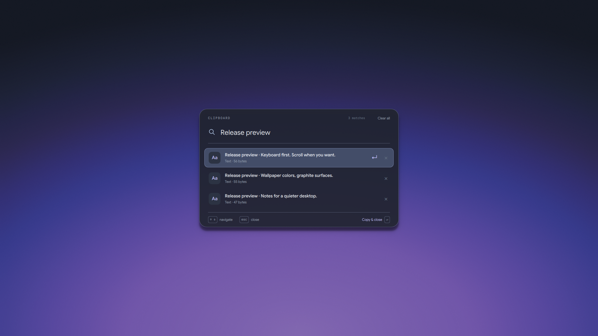
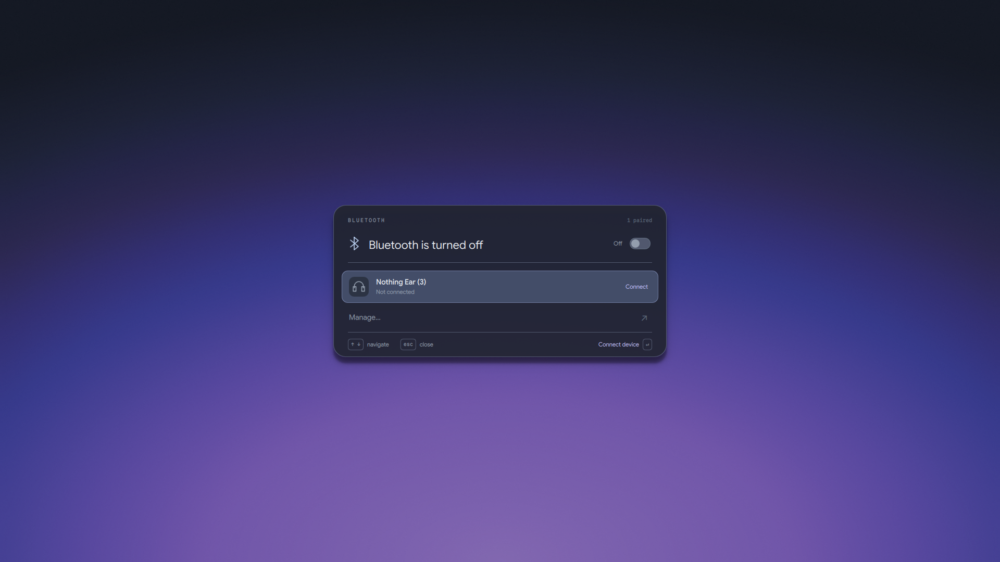
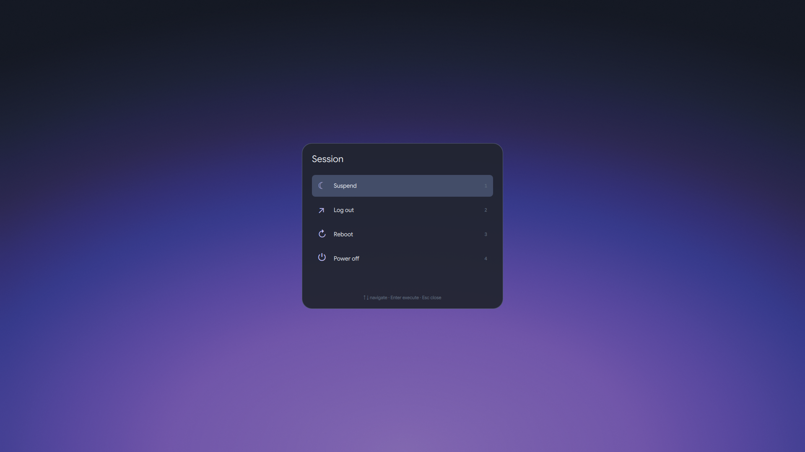
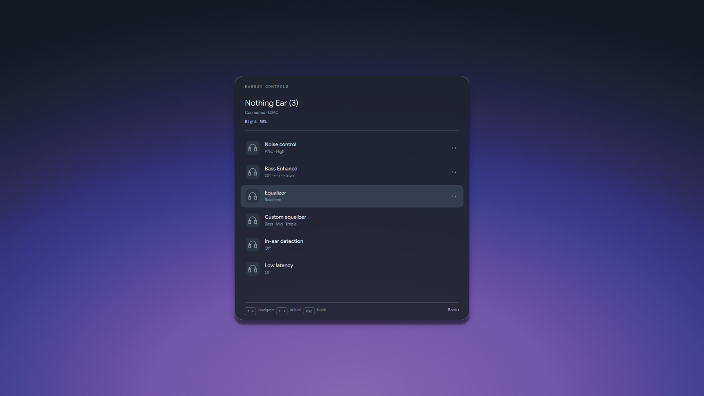
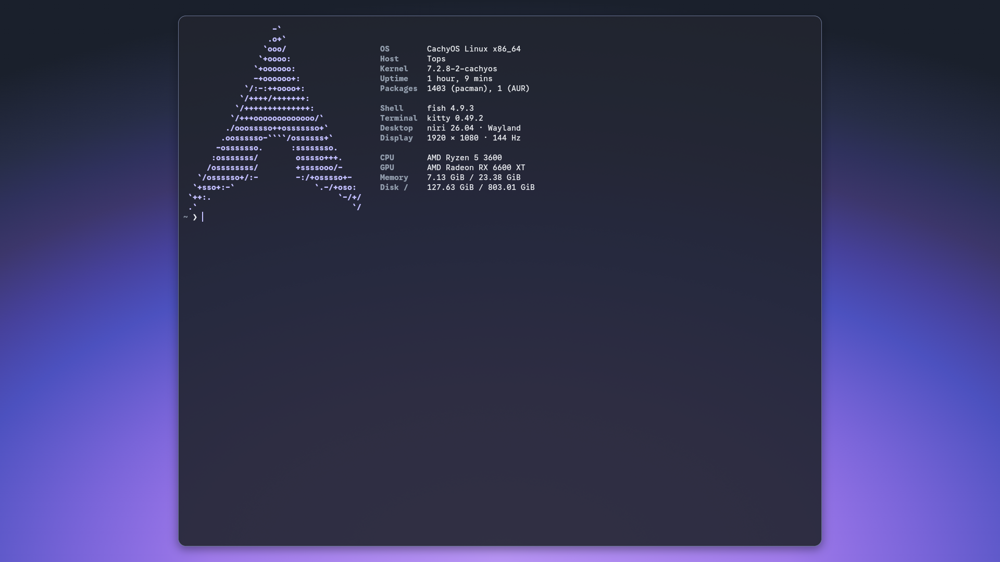
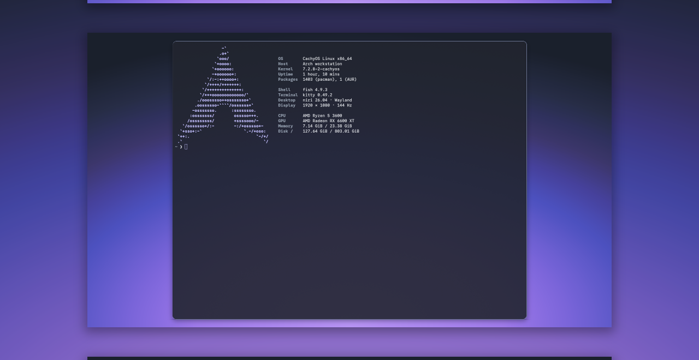
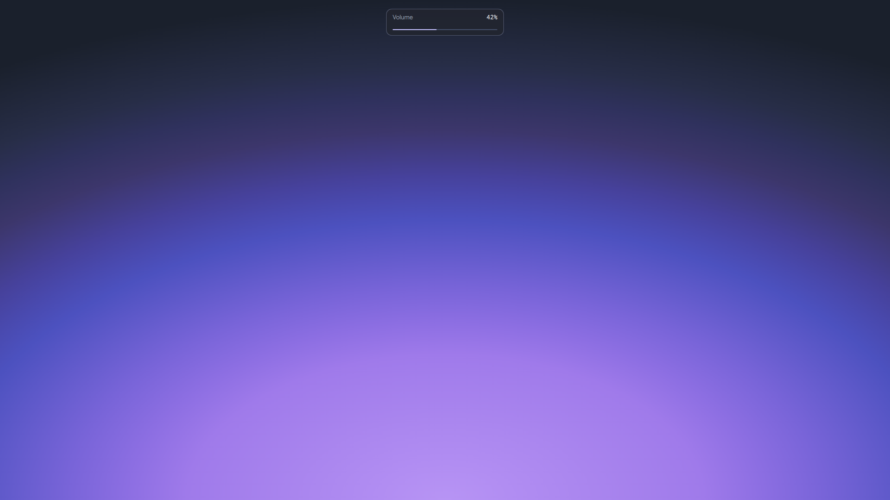

# v0.12 screenshot gallery

Real Niri-session captures, taken before publication. This gallery uses the
active custom blue/violet wallpaper; fresh-install defaults are configured
separately. Clipboard text is deliberately created sample content. The volume
readout shows a sample 42% through its real UI without changing playback volume.
The terminal screenshot was provided and approved by the project owner.

## Launcher and clipboard

| Applications | Clipboard — sample content |
| --- | --- |
|  |  |

## Bluetooth and session controls

| Paired device and radio switch | Power/session menu |
| --- | --- |
|  |  |

Earbud batteries reflect what the connected hardware reported at capture time;
unavailable left/case values are not invented.

## Terminal and native Niri overview

The overview image is captured from the central area of the output to keep
unrelated workspace contents out of the gallery. It is not a mockup.

## Volume and desktop

